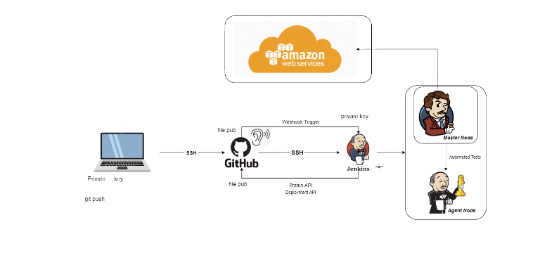

# CICD
## Docker
- Virtualization platform to containerise your app. Continuous Integration Efficiency with Dcoker enables you to build a container image and use that same image across every step of the deployment process. 
- A huge benefit of this is to seperate non dependent steps and run them in parallel. 

## Continuous Integration
- Developers merge/commit code to master branch multiple times a day, fully automated build and test process which gives feedback within minutes, this avoids integration problems that usually occur when people wait for release day to merge thier changes into the release branch.

## Continuous Delivery
- An extension of continuous integration to make sure that you can release new changes to your customers quickly in a sustainable way. Therefore on top of having automated testing, the release process has also been automated so you can deploy your app at any point of time by clicking a button. In continuous delivery the deployment is completed manually. 

## Continuous Deployment 
- Every change that passes all satges of production pipeline is released to your customers, there is no human intervention and only a failed test will prevent new change to be deployed to production. 

## CI/CD Pipeline
- All about automation, initiating code builds, automated testing and automated deployment to the staging or production environments. This is incredibly fast, if the output of any stage fails then the next stage will also fail. 

## Jenkins

- An open source automation server in which central build and CI process takes place, Java-based prgram with packages for Windows, macOS and Linux.
- Many benefits:
    - Great Range of plugins
    - Supports building
    - deploying
    - automating software development projects
    - easy installation
    - simple and user friendly interface
    - extensible with huge community contributed plugin resource
    - easy enviornment configuration
    - supports distributed builds with master-slave architecture
Jenkins Pipeline Step by Step:
- Start Jenkins and login 
- Create new item, give it a name and select Freestyle project
- Configure the item with a description and set number of max builds
- At the end of the page add build step, select execute shell and type a linux command such as `uname -a`
- apply and save and then build the project and check console output
- To create a simple pipeline, create a second job using the same steps, then navigate to the first job and select configure job to add a post-job action and enter the name of the second job. Save and apply
- When you run the first job it will automatically run the second right after and you can see the console output of both jobs.
- Jenkins can work directly with github by linking a repo directly ro jenkins and creating a new build to automate testing and automate the build by then selecting an post build action. 

## SSH 
- Generate new key with the following command:
- `ssh-keygen -t rsa -b 4096 -C "your-email"` 