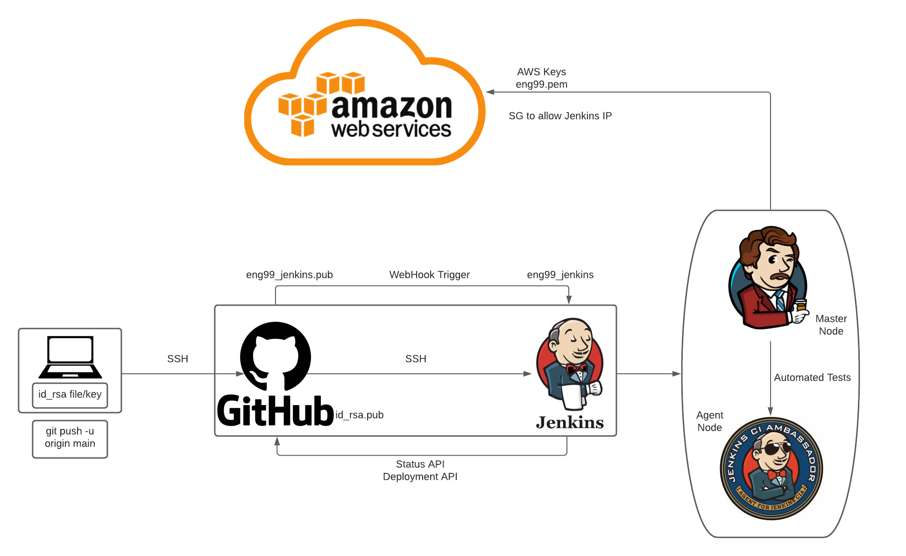
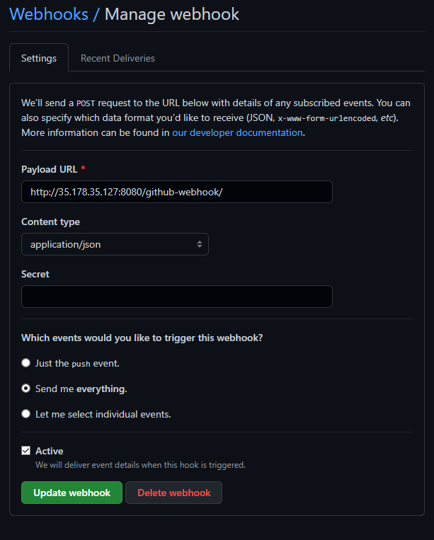
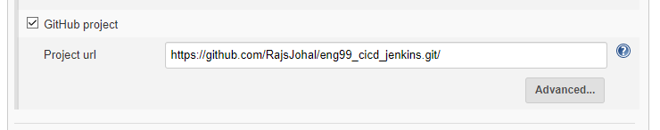
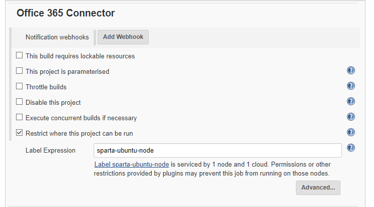
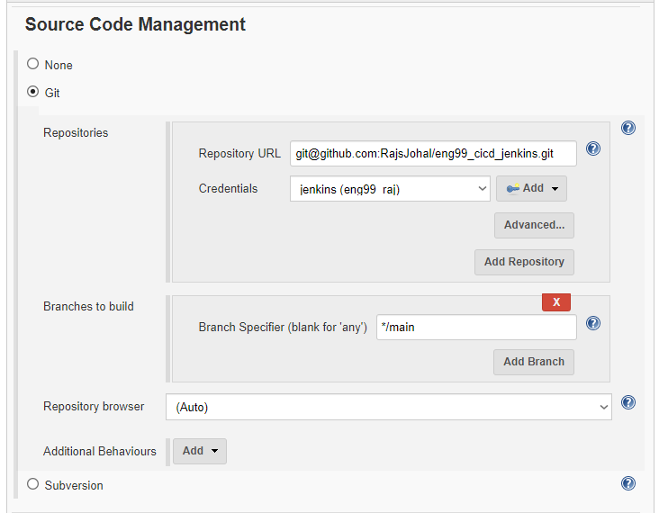
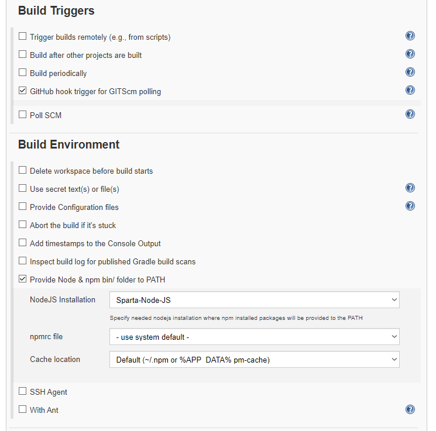
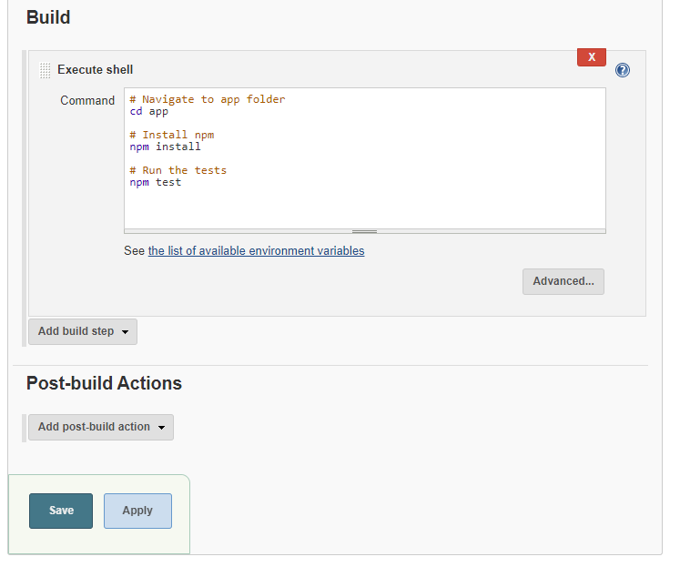
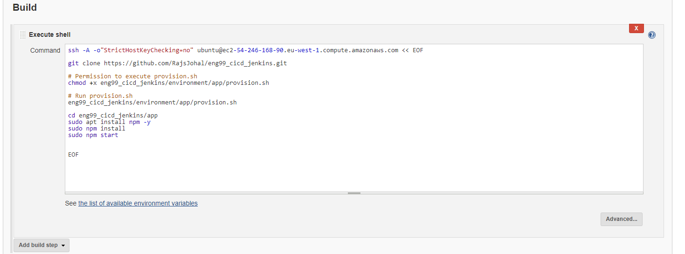

# CICD
## Docker
- Virtualization platform to containerise your app. Continuous Integration Efficiency with Dcoker enables you to build a container image and use that same image across every step of the deployment process. 
- A huge benefit of this is to seperate non dependent steps and run them in parallel. 

## Continuous Integration
- Developers merge/commit code to master branch multiple times a day, fully automated build and test process which gives feedback within minutes, this avoids integration problems that usually occur when people wait for release day to merge thier changes into the release branch.

## Continuous Delivery
- An extension of continuous integration to make sure that you can release new changes to your customers quickly in a sustainable way. Therefore on top of having automated testing, the release process has also been automated so you can deploy your app at any point of time by clicking a button. In continuous delivery the deployment is completed manually. 

## Continuous Deployment 
- Every change that passes all satges of production pipeline is released to your customers, there is no human intervention and only a failed test will prevent new change to be deployed to production. 

## CI/CD Pipeline
- All about automation, initiating code builds, automated testing and automated deployment to the staging or production environments. This is incredibly fast, if the output of any stage fails then the next stage will also fail. 

## Jenkins

- An open source automation server in which central build and CI process takes place, Java-based prgram with packages for Windows, macOS and Linux.
- Many benefits:
    - Great Range of plugins
    - Supports building
    - deploying
    - automating software development projects
    - easy installation
    - simple and user friendly interface
    - extensible with huge community contributed plugin resource
    - easy enviornment configuration
    - supports distributed builds with master-slave architecture
Jenkins Pipeline Step by Step:
- Start Jenkins and login 
- Create new item, give it a name and select Freestyle project
- Configure the item with a description and set number of max builds
- At the end of the page add build step, select execute shell and type a linux command such as `uname -a`
- apply and save and then build the project and check console output
- To create a simple pipeline, create a second job using the same steps, then navigate to the first job and select configure job to add a post-job action and enter the name of the second job. Save and apply
- When you run the first job it will automatically run the second right after and you can see the console output of both jobs.
- Jenkins can work directly with github by linking a repo directly ro jenkins and creating a new build to automate testing and automate the build by then selecting an post build action. 

## SSH Key
- Generate new key with the following command:
- `ssh-keygen -t rsa -b 4096 -C "your-email"` 

## Git and Jenkins Task
- Create a new repo with app folder
- Generate new SSH key
- Copy public key into the repo
- Create a WebHook on Github to link to Jenkins

- On Jenkins, build a new job 
- provide github project url https

- Connection

- provide ssh github url address

- Build Triggers set to GitHub hook trigger for GITScm polling
- Build Environment

- run commands
- cd app
- npm install
- npm test
- check homepage
- check fibonacci value

- Jenkins test rests in a slave node, and the results are shown on the jenkins master node, the tests are run on an EC2 instance on AWS. 
- Webhook, as soon as we push changes to the repo, the changes are immediatley pushed to jenkins and jenkins can build and test the changes and display the results. 
- Webhook is created in GitHub, navigate to setting within the repo, webhook and create webhook link to jenkins.  

## Task 1
- Create another job yourname_ci_merge
- create a new branch on localhost called dev
- change main to dev in first job config 
- make any changes in your README.md on local host and push to github
- if test passes it should trigger next job 
yourname_ci_merge
- merge job should simply merge code from dev to main

## Task 1 Completed
- Install GitHub plugin in jenkins
- Changed the branch specifier in first job to */dev and added post build action to run 2nd job.
- Created 2nd job ci_merge with same configuration, however added additional behavior in source code management to merge before build:
    - name of repo = origin
    - branch to merge to = main
    - merge strategy = default
    - Fast-forward mode = --ff
- Also added post build action to git push changes so they appear on github. 

## Task 2
- 3rd job CD/CDE should get code from main
- deliver to AWS EC2 
- ssh into machine 
- cd app
- npm install
- npm start
- final iteration fourth job to deploy and run app

## Task 2 completed 
- 3rd job is to build once 1st and 2nd jobs are completed
- Build has same setup as before 
- Build from main branch 
- Build Environment uses SSH agent, eng99.pem key is required to login to EC2 instance
- Execute shell command to automate:
    - the ssh login 
    - github repo copy - rsync -avz = -i"eng99.pem" app ubuntu@<OWN-IP-ADDRESS>:/home/ubuntu
    - run the provision file 
    - npm install, and npm start

## Set up of CI/CD Pipeline of App and DB 
- How to start a pipeline for DB:  
    - Create a new instance on AWS for DB and create security groups to link to Jenkins and the jenkins app instance. 
    - Within jenkins, ssh into DB instance, download the db provisioning file to install mongodb, change the mongod.conf BindIP to 0.0.0.0 by using `cp` to copy a new mongod.conf file 
    - App instance needs the env var `DB_Host="mongodb://DBEC2IP:27017/posts"`

- 4 Projects total
    - One for Test
    - One for merge
    - One to deploy DB
    - Last to deploy app

- 1 Blocker 
    - Cant get posts to load, web page shows cannot GET /posts